## Service for working with user balances

> Created for the [Avito Internship](https://github.com/avito-tech/internship_backend_2022)

### Makefile options

```bash
# Build app in docker container
make docker-build

# Update swagger, swagger is available at /swagger/index.html.
# Also awailable at /docs folder
#
# Clearly describes the API
make swagger

# Run tests, have service and some postgresql tests
make test

# Run service locally
make run

# Run migrations, after building service run this command
# If necessary, you can change the connection parameters in the Makefile
make migrate-up
```

### Service description [ENG]

#### Environment variables

All environment variables are described in the `config/config.go` file

Can be replaced by a file with the name `.env` in the root of the project

#### Models

We have:

- User: `/internal/models/user.go`
- Service: `/internal/models/service.go`
- Transaction: `/internal/models/transaction.go`
- Reservation: `/internal/models/transaction.go`

If first two are clearly understandable, then the last two are not.

The **transaction** is a money operation between the user and the service, that happens all the time.

The **reservation** is a transaction between the user and the service for a specific order and fixed amount of money,
that can be cancelled or confirmed.
Before confirmation the money are just dummy and can be cancelled. Аfter confirmation the
money are real and will be withdrawn from the user's balance.

#### Why that?

The main idea is to make a reservation real only after the order is confirmed. If the order is cancelled, then the money
are not changed.

`/api/v1/transaction/replenisment`, `/api/v1/transaction/withdrawal`

If some billing service come to us, he needs to use a replenishment transaction on withdrawal.

`/api/v1/transaction/reservation`, `/api/v1/transaction/release`, `/api/v1/transaction/cancel`

If user wants to buy some order in outer service, he needs to make a reservation, then confirm it, then transaction
will be applied automatically.

`/api/v1/transaction/report`

Report supports two formats: `json` and `csv`.

Takes all the **released** reservations and group them by service and order.

`/api/v1/transaction/user/{id}`

Returns all the transactions for the user with pagination.

### Service description [RU]

#### Переменные окружения

Все переменные окружения описаны в файле `config/config.go`

Могут быть заменены файлом `.env` в корне проекта

#### Модели

У нас есть:

- Пользователь: `/internal/models/user.go`
- Сервис: `/internal/models/service.go`
- Транзакция: `/internal/models/transaction.go`
- Резервирование: `/internal/models/transaction.go`

Если первые два понятны, то последние два нет.

**Транзакция** — это денежная операция между пользователем и сервисом, которая происходит постоянно.

**Бронирование** — это транзакция между пользователем и сервисом для определенного заказа и фиксированной суммы денег,
которая
можно отменить или подтвердить. До подтверждения деньги являются фиктивными и отмена никак не повлияет на баланс
пользователя

#### Почему так?

Основная идея заключается в том, чтобы сделать бронирование реальным только после подтверждения заказа. Если заказ
отменяется, то деньги не снимаются.

`/api/v1/transaction/replenisment`, `/api/v1/transaction/withdrawal`

Если к нам приходит какой-то биллинговый сервис, ему нужно использовать транзакцию пополнения при выводе.

`/api/v1/transaction/reservation`, `/api/v1/transaction/release`, `/api/v1/transaction/cancel`

Если пользователь хочет купить какой-либо заказ во внешнем сервисе, ему необходимо сделать резервирование, затем
подтвердить его, тогда транзакция расчитается автоматически

`/api/v1/transaction/report`

Отчет поддерживает два формата: `json` и `csv`.

Собирает все **подтвержденные** бронирования и группирует их по услугам и заказам.

#### Примеры

> Я не смог расшарить `postman` коллекцию...((((
>
> В `swagger` все по красоте, можно там посмотреть

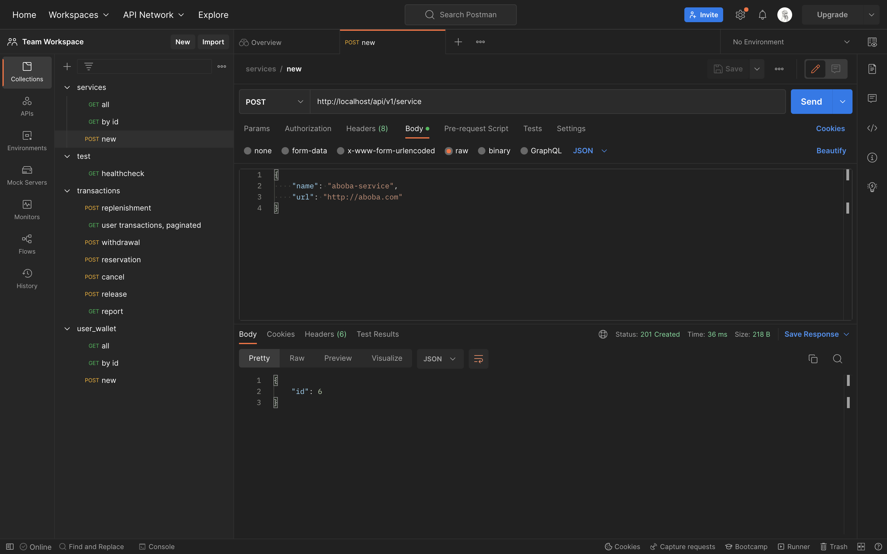
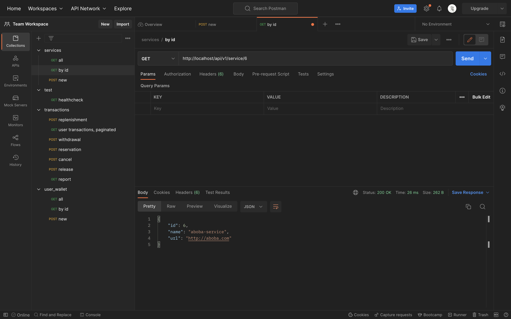
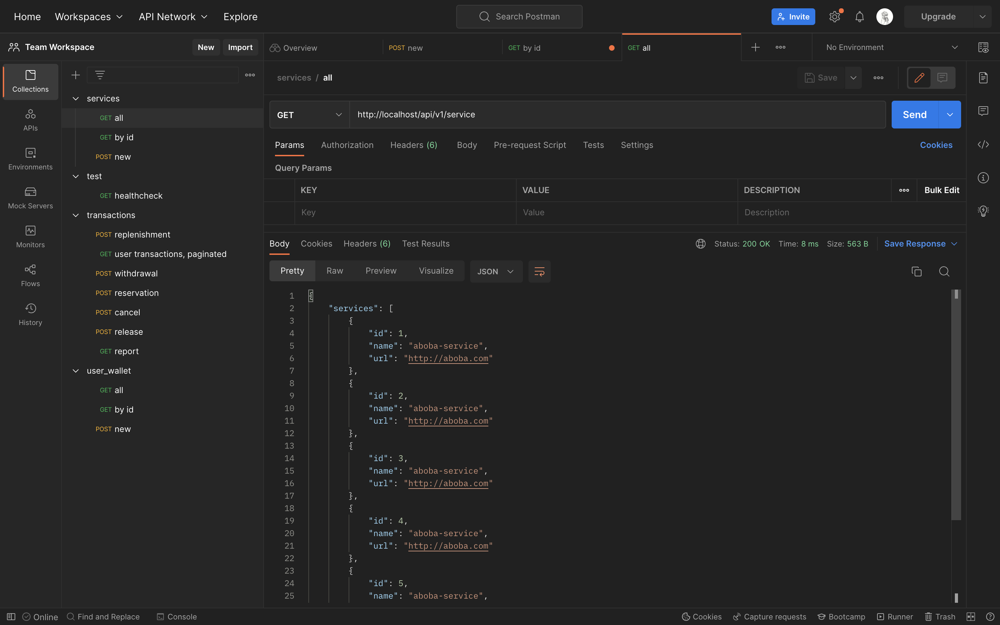
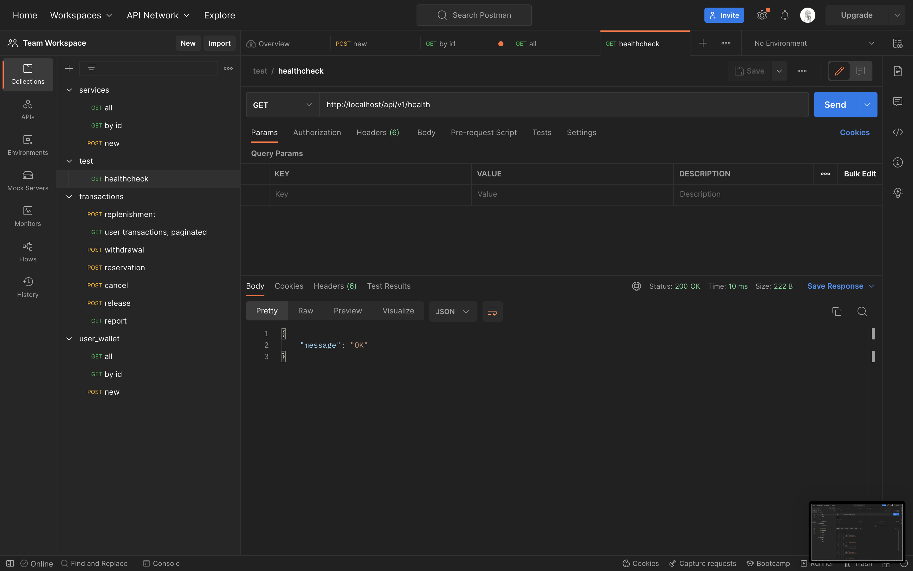
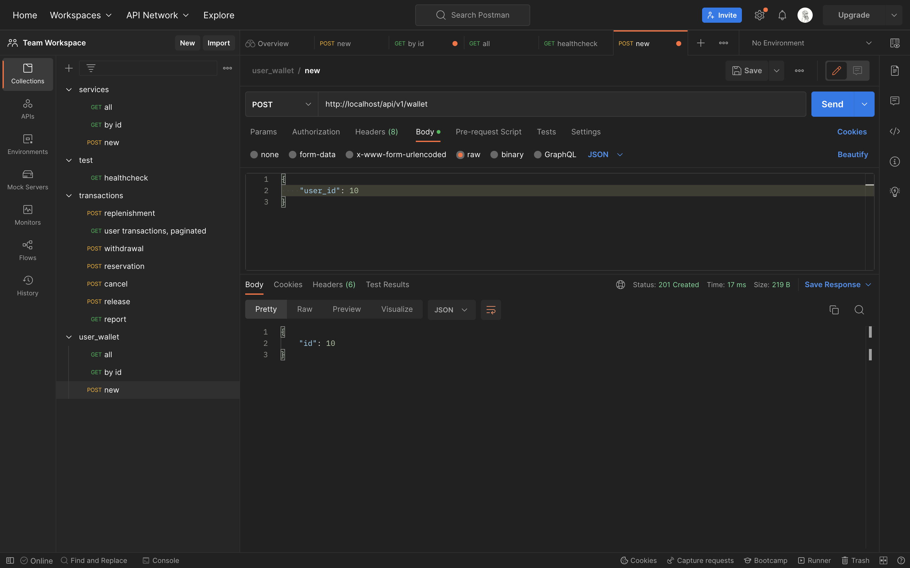
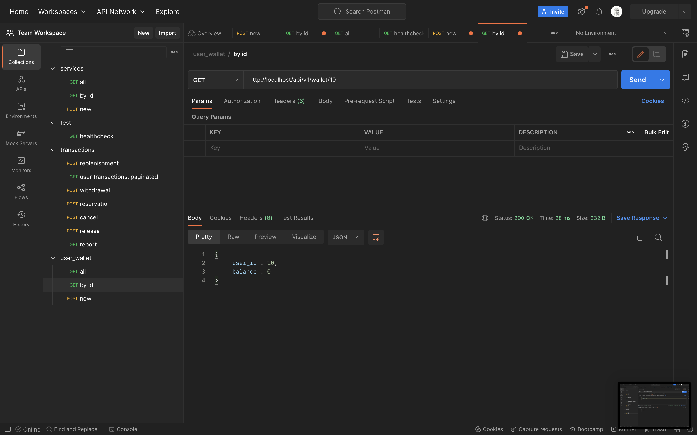
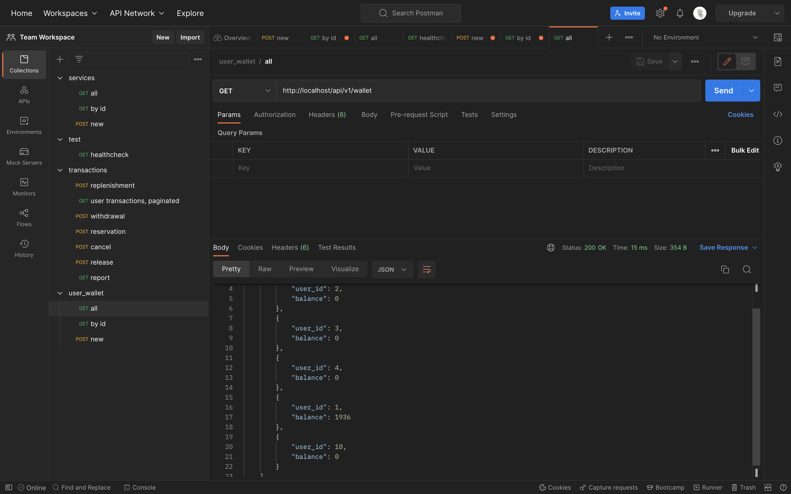
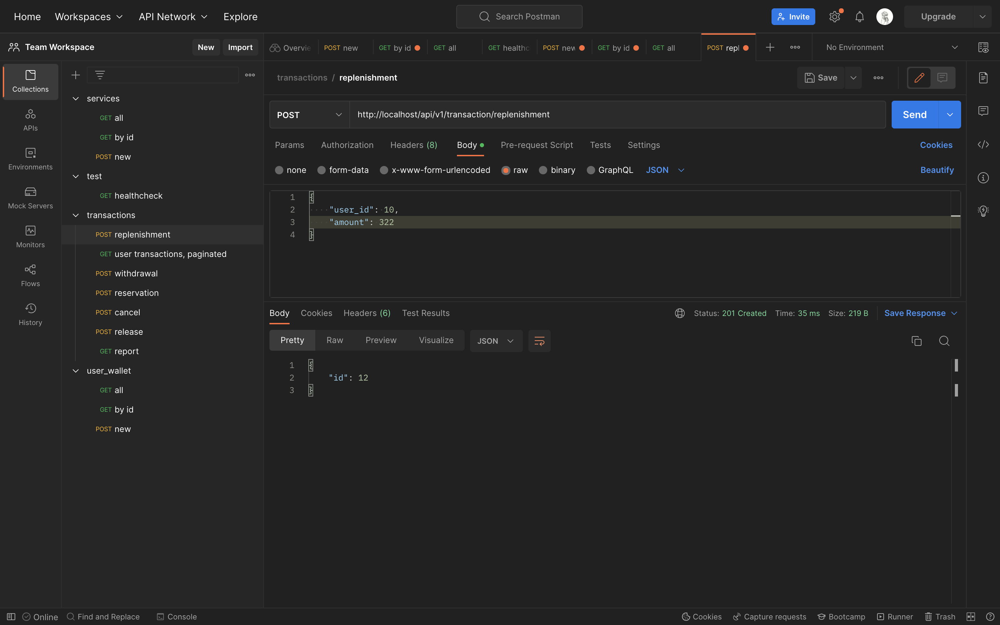

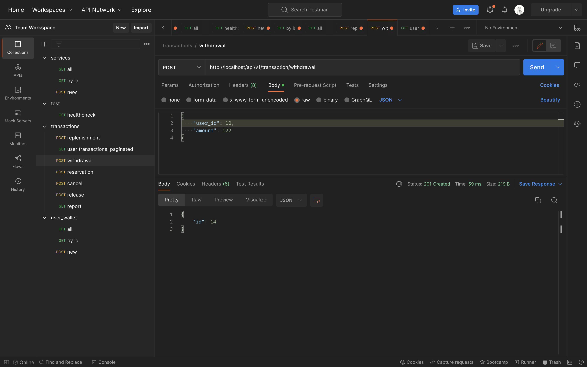
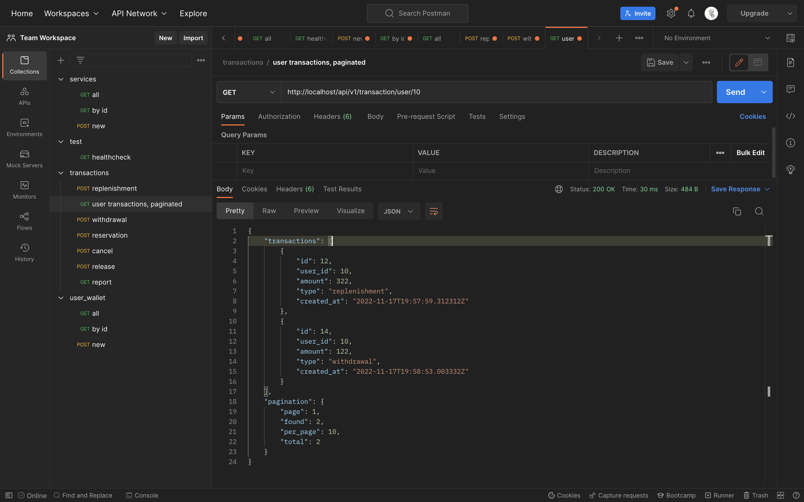
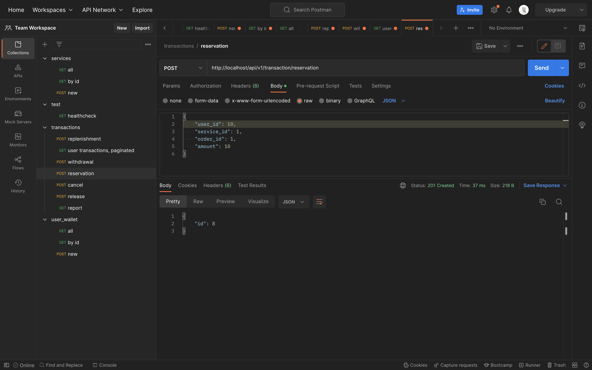
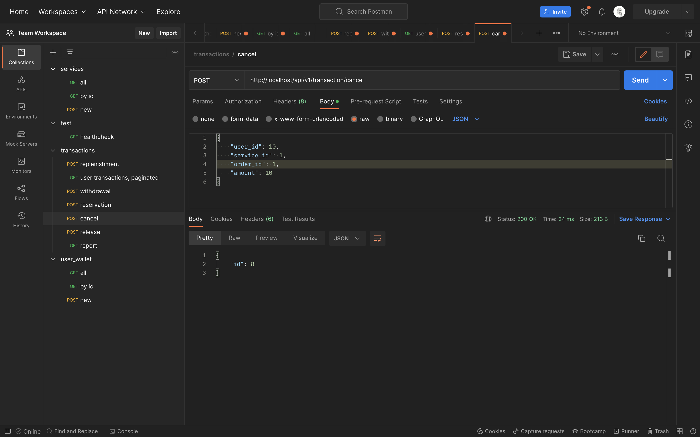
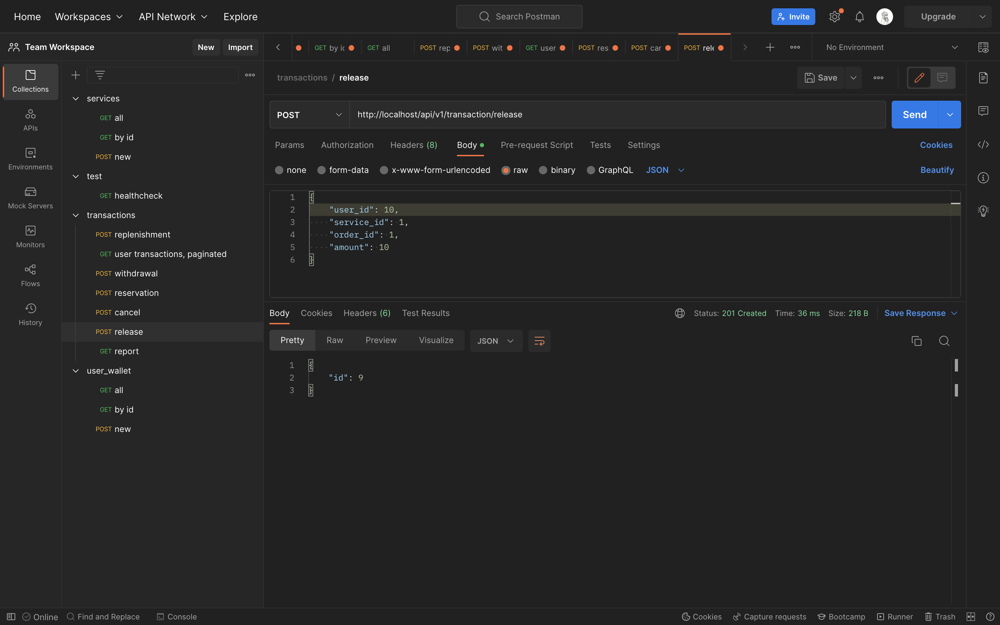
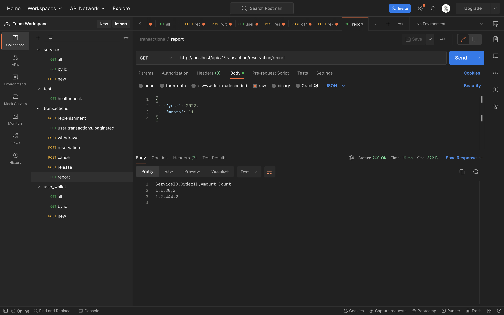
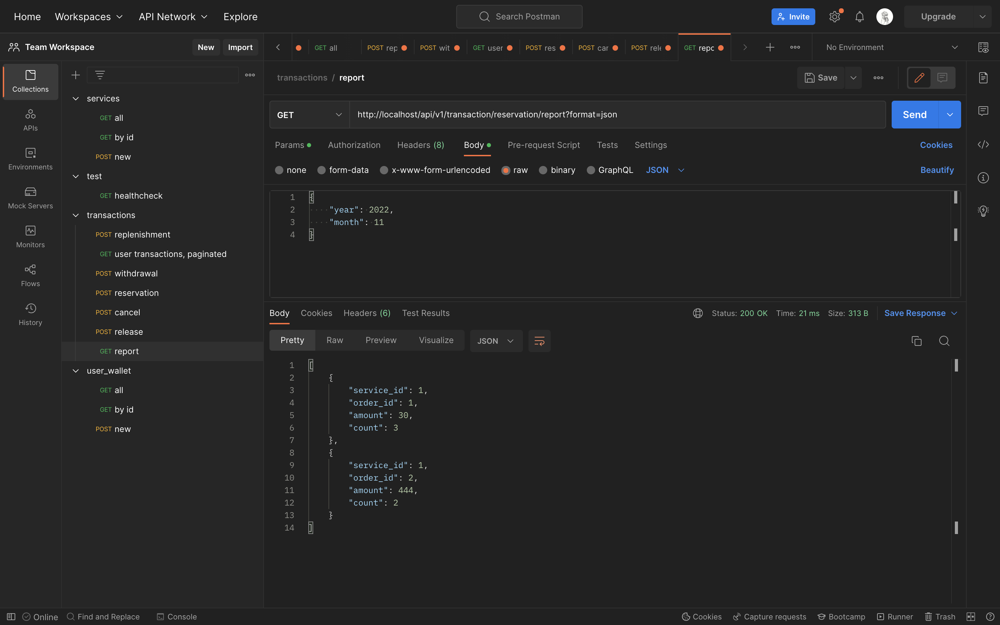

#### Доработки в будущем

- [ ] В некоторых случаях валидация происходит при самом запросе в базу
- [ ] Дописать тесты на handelers
- [ ] Дописать тесты на postgres
- [ ] К транзакциям можно прикрутить описание

#### Что мне не нравится в этом сервисе

- Мы разделяем перевод денег между счетами, по-хорошему это должен делать один сервис, а не два разных
